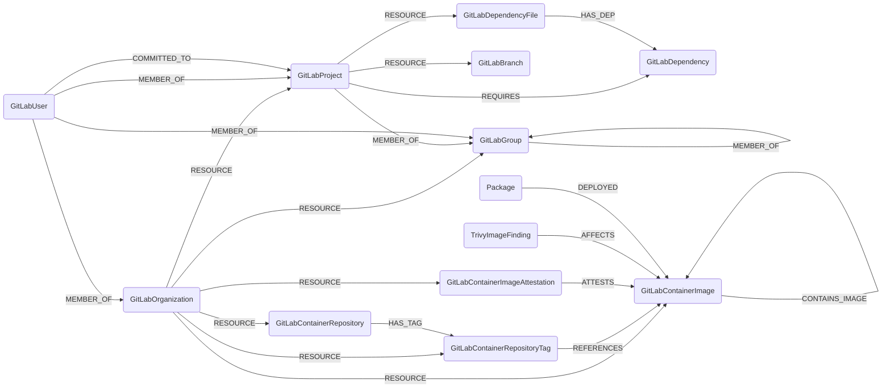

## GitLab Schema



### GitLabOrganization

Representation of a GitLab top-level group (organization). In GitLab, organizations are typically the root-level groups that contain projects and nested subgroups.

| Field | Description |
|-------|--------------|
| firstseen | Timestamp of when a sync job first created this node |
| lastupdated | Timestamp of the last time the node was updated |
| **id** | The web URL of the GitLab organization/group |
| **name** | Name of the organization |
| **path** | URL path slug |
| **full_path** | Full path including all parent groups |
| description | Description of the organization |
| visibility | Visibility level (private, internal, public) |
| parent_id | Parent group ID (null for top-level organizations) |
| created_at | GitLab timestamp from when the organization was created |

#### Relationships

- GitLabOrganizations contain GitLabGroups (nested subgroups).

    ```
    (GitLabOrganization)-[RESOURCE]->(GitLabGroup)
    ```

- GitLabOrganizations contain GitLabProjects.

    ```
    (GitLabOrganization)-[RESOURCE]->(GitLabProject)
    ```

- GitLabUsers can be members of GitLabOrganizations with different access levels.

    ```
    (GitLabUser)-[MEMBER_OF{role, access_level}]->(GitLabOrganization)
    ```

    The `role` property can be: owner, maintainer, developer, reporter, guest.
    The `access_level` property corresponds to GitLab's numeric levels: 50, 40, 30, 20, 10.

### GitLabGroup

Representation of a GitLab nested subgroup. Groups can contain other groups (creating a hierarchy) and projects.

| Field | Description |
|-------|--------------|
| firstseen | Timestamp of when a sync job first created this node |
| lastupdated | Timestamp of the last time the node was updated |
| **id** | The web URL of the GitLab group |
| **name** | Name of the group |
| **path** | URL path slug |
| **full_path** | Full path including all parent groups |
| description | Description of the group |
| visibility | Visibility level (private, internal, public) |
| parent_id | Parent group ID |
| created_at | GitLab timestamp from when the group was created |

#### Relationships

- GitLabGroups are resources under GitLabOrganizations.

    ```
    (GitLabOrganization)-[RESOURCE]->(GitLabGroup)
    ```

- GitLabGroups can be members of parent GitLabGroups (nested structure).

    ```
    (GitLabGroup)-[MEMBER_OF]->(GitLabGroup)
    ```

- GitLabProjects can be members of GitLabGroups.

    ```
    (GitLabProject)-[MEMBER_OF]->(GitLabGroup)
    ```

- GitLabUsers can be members of GitLabGroups with different access levels.

    ```
    (GitLabUser)-[MEMBER_OF{role, access_level}]->(GitLabGroup)
    ```

### GitLabProject:GitLabRepository

Representation of a GitLab project (repository). Projects are GitLab's equivalent of repositories and can belong to organizations or groups. The `GitLabRepository` label is included for backwards compatibility with existing queries.

| Field | Description |
|-------|--------------|
| firstseen | Timestamp of when a sync job first created this node |
| lastupdated | Timestamp of the last time the node was updated |
| **id** | The web URL of the GitLab project |
| **name** | Name of the project |
| **path** | URL path slug |
| **path_with_namespace** | Full path including namespace |
| description | Description of the project |
| visibility | Visibility level (private, internal, public) |
| default_branch | Default branch name (e.g., main, master) |
| archived | Whether the project is archived |
| created_at | GitLab timestamp from when the project was created |
| last_activity_at | GitLab timestamp of last activity |
| languages | JSON string containing detected programming languages and their percentages (e.g., `{"Python": 65.5, "JavaScript": 34.5}`) |

#### Sample Language Queries

Get all unique languages used across your GitLab estate:

```cypher
MATCH (p:GitLabProject)
WHERE p.languages IS NOT NULL
WITH p, apoc.convert.fromJsonMap(p.languages) AS langs
UNWIND keys(langs) AS language
RETURN DISTINCT language
ORDER BY language
```

Find all projects using a specific language (e.g., Python):

```cypher
MATCH (p:GitLabProject)
WHERE p.languages CONTAINS '"Python"'
RETURN p.name, p.languages
```

Get language distribution with project counts:

```cypher
MATCH (p:GitLabProject)
WHERE p.languages IS NOT NULL
WITH p, apoc.convert.fromJsonMap(p.languages) AS langs
UNWIND keys(langs) AS language
WITH language, langs[language] AS percentage, p
RETURN language, count(p) AS project_count, avg(percentage) AS avg_percentage
ORDER BY project_count DESC
```

**Note:** The `CONTAINS` query does a string search and works without APOC. For more precise queries (like filtering by percentage), use `apoc.convert.fromJsonMap()` to parse the JSON.

#### Relationships

- GitLabProjects belong to GitLabOrganizations.

    ```
    (GitLabOrganization)-[RESOURCE]->(GitLabProject)
    ```

- GitLabProjects can be members of GitLabGroups.

    ```
    (GitLabProject)-[MEMBER_OF]->(GitLabGroup)
    ```

- GitLabUsers can be members of GitLabProjects with different access levels.

    ```
    (GitLabUser)-[MEMBER_OF{role, access_level}]->(GitLabProject)
    ```

    The `role` property can be: owner, maintainer, developer, reporter, guest.
    The `access_level` property corresponds to GitLab's numeric levels: 50, 40, 30, 20, 10.

- GitLabUsers who have committed to GitLabProjects are tracked with commit activity data.

    ```
    (GitLabUser)-[COMMITTED_TO]->(GitLabProject)
    ```

    This relationship includes the following properties:
    - **commit_count**: Number of commits made by the user to the project
    - **last_commit_date**: Timestamp of the user's most recent commit to the project
    - **first_commit_date**: Timestamp of the user's oldest commit to the project

- GitLabProjects have GitLabBranches.

    ```
    (GitLabProject)-[RESOURCE]->(GitLabBranch)
    ```

- GitLabProjects have GitLabDependencyFiles.

    ```
    (GitLabProject)-[RESOURCE]->(GitLabDependencyFile)
    ```

- GitLabProjects require GitLabDependencies.

    ```
    (GitLabProject)-[REQUIRES]->(GitLabDependency)
    ```

### GitLabUser

Representation of a GitLab user. Users can be members of organizations, groups, and projects.

| Field | Description |
|-------|--------------|
| firstseen | Timestamp of when a sync job first created this node |
| lastupdated | Timestamp of the last time the node was updated |
| **id** | The web URL of the GitLab user |
| **username** | Username of the user |
| name | Full name of the user |
| state | State of the user (active, blocked, etc.) |
| email | Email address of the user (if public) |
| is_admin | Whether the user is an admin |

#### Relationships

- GitLabUsers can be members of GitLabOrganizations.

    ```
    (GitLabUser)-[MEMBER_OF{role, access_level}]->(GitLabOrganization)
    ```

- GitLabUsers can be members of GitLabGroups.

    ```
    (GitLabUser)-[MEMBER_OF{role, access_level}]->(GitLabGroup)
    ```

- GitLabUsers can be members of GitLabProjects.

    ```
    (GitLabUser)-[MEMBER_OF{role, access_level}]->(GitLabProject)
    ```

- GitLabUsers who have committed to GitLabProjects are tracked.

    ```
    (GitLabUser)-[COMMITTED_TO{commit_count, last_commit_date, first_commit_date}]->(GitLabProject)
    ```

### GitLabBranch

Representation of a GitLab branch within a project.

| Field | Description |
|-------|--------------|
| firstseen | Timestamp of when a sync job first created this node |
| lastupdated | Timestamp of the last time the node was updated |
| **id** | Unique identifier: `{project_url}/tree/{branch_name}` |
| **name** | Name of the branch |
| protected | Whether the branch is protected |
| default | Whether this is the default branch |
| web_url | Web URL to view the branch |

#### Relationships

- GitLabProjects have GitLabBranches.

    ```
    (GitLabProject)-[RESOURCE]->(GitLabBranch)
    ```

### GitLabDependencyFile

Representation of a dependency manifest file (e.g., package.json, requirements.txt, pom.xml) within a GitLab project.

| Field | Description |
|-------|--------------|
| firstseen | Timestamp of when a sync job first created this node |
| lastupdated | Timestamp of the last time the node was updated |
| **id** | Unique identifier: `{project_url}/blob/{file_path}` |
| **path** | Path to the file in the repository |
| **filename** | Name of the file (e.g., package.json) |

#### Relationships

- GitLabProjects have GitLabDependencyFiles.

    ```
    (GitLabProject)-[RESOURCE]->(GitLabDependencyFile)
    ```

- GitLabDependencyFiles contain GitLabDependencies.

    ```
    (GitLabDependencyFile)-[HAS_DEP]->(GitLabDependency)
    ```

### GitLabDependency

Representation of a software dependency from GitLab's dependency scanning artifacts (Gemnasium). This node contains information about a package dependency detected via GitLab's security scanning.

| Field | Description |
|-------|--------------|
| firstseen | Timestamp of when a sync job first created this node |
| lastupdated | Timestamp of the last time the node was updated |
| **id** | Unique identifier: `{project_url}:{package_manager}:{name}@{version}` |
| **name** | Name of the dependency |
| **version** | Version of the dependency |
| **package_manager** | Package manager (npm, pip, maven, etc.) |

#### Relationships

- GitLabProjects require GitLabDependencies.

    ```
    (GitLabProject)-[REQUIRES]->(GitLabDependency)
    ```

- GitLabDependencyFiles contain GitLabDependencies (when the manifest file can be determined).

    ```
    (GitLabDependencyFile)-[HAS_DEP]->(GitLabDependency)
    ```

### GitLabContainerRepository

Representation of a GitLab container registry repository. Each project can have multiple container repositories at different paths (e.g., project root, /app, /worker).

| Field | Description |
|-------|--------------|
| firstseen | Timestamp of when a sync job first created this node |
| lastupdated | Timestamp of the last time the node was updated |
| **id** | The full location of the repository (e.g., `registry.gitlab.com/group/project/app`) |
| **name** | Name of the repository |
| **path** | Path within the project |
| repository_id | GitLab's internal repository ID |
| project_id | ID of the parent project |
| created_at | GitLab timestamp from when the repository was created |
| cleanup_policy_started_at | Timestamp of last cleanup policy run |
| tags_count | Number of tags in the repository |
| size | Size of the repository in bytes |
| status | Repository status |

#### Relationships

- GitLabContainerRepositories belong to GitLabOrganizations.

    ```
    (GitLabOrganization)-[RESOURCE]->(GitLabContainerRepository)
    ```

- GitLabContainerRepositories have GitLabContainerRepositoryTags.

    ```
    (GitLabContainerRepository)-[HAS_TAG]->(GitLabContainerRepositoryTag)
    ```

### GitLabContainerRepositoryTag

Representation of a tag within a GitLab container repository. Tags are human-readable pointers to container images.

| Field | Description |
|-------|--------------|
| firstseen | Timestamp of when a sync job first created this node |
| lastupdated | Timestamp of the last time the node was updated |
| **id** | The full location of the tag (e.g., `registry.gitlab.com/group/project/app:v1.0.0`) |
| **name** | Name of the tag (e.g., `latest`, `v1.0.0`) |
| path | Path including tag name |
| repository_location | Location of the parent repository |
| revision | Full commit revision |
| short_revision | Short commit revision |
| digest | Image digest this tag references (e.g., `sha256:abc...`) |
| created_at | GitLab timestamp from when the tag was created |
| total_size | Total size of the image in bytes |

#### Relationships

- GitLabContainerRepositoryTags belong to GitLabOrganizations (for cleanup).

    ```
    (GitLabOrganization)-[RESOURCE]->(GitLabContainerRepositoryTag)
    ```

- GitLabContainerRepositoryTags belong to GitLabContainerRepositories.

    ```
    (GitLabContainerRepository)-[HAS_TAG]->(GitLabContainerRepositoryTag)
    ```

- GitLabContainerRepositoryTags reference GitLabContainerImages.

    ```
    (GitLabContainerRepositoryTag)-[REFERENCES]->(GitLabContainerImage)
    ```

### GitLabContainerImage

Representation of a container image identified by its digest. Images are content-addressable and can be referenced by multiple tags. Manifest lists (multi-architecture images) contain references to platform-specific child images.

| Field | Description |
|-------|--------------|
| firstseen | Timestamp of when a sync job first created this node |
| lastupdated | Timestamp of the last time the node was updated |
| **id** | The image digest (e.g., `sha256:abc123...`) |
| digest | Same as id, the image digest |
| uri | The base repository URI (e.g., `registry.gitlab.com/group/project`) |
| media_type | OCI/Docker media type of the manifest |
| schema_version | Manifest schema version |
| type | Either `image` (single platform) or `manifest_list` (multi-arch) |
| architecture | CPU architecture (e.g., `amd64`, `arm64`) - null for manifest lists |
| os | Operating system (e.g., `linux`) - null for manifest lists |
| variant | Architecture variant (e.g., `v8`) - null for manifest lists |
| child_image_digests | List of child image digests (only for manifest lists) |

#### Relationships

- GitLabContainerImages belong to GitLabOrganizations (for cleanup and cross-project deduplication).

    ```
    (GitLabOrganization)-[RESOURCE]->(GitLabContainerImage)
    ```

- GitLabContainerImages (manifest lists) contain child GitLabContainerImages.

    ```
    (GitLabContainerImage)-[CONTAINS_IMAGE]->(GitLabContainerImage)
    ```

- GitLabContainerRepositoryTags reference GitLabContainerImages.

    ```
    (GitLabContainerRepositoryTag)-[REFERENCES]->(GitLabContainerImage)
    ```

- GitLabContainerImageAttestations attest to GitLabContainerImages.

    ```
    (GitLabContainerImageAttestation)-[ATTESTS]->(GitLabContainerImage)
    ```

- TrivyImageFindings affect GitLabContainerImages.

    ```
    (TrivyImageFinding)-[AFFECTS]->(GitLabContainerImage)
    ```

- Packages are deployed in GitLabContainerImages.

    ```
    (Package)-[DEPLOYED]->(GitLabContainerImage)
    ```

- KubernetesContainers have images. The relationship matches containers to images by digest (`status_image_sha`).

    ```
    (KubernetesContainer)-[HAS_IMAGE]->(GitLabContainerImage)
    ```

### GitLabContainerImageAttestation

Representation of a container image attestation (signature or provenance). Attestations can be discovered via two methods: cosign tag-based (`.sig`, `.att` suffixes) or buildx embedded (stored in manifest lists with `attestation-manifest` annotation).

| Field | Description |
|-------|--------------|
| firstseen | Timestamp of when a sync job first created this node |
| lastupdated | Timestamp of the last time the node was updated |
| **id** | The attestation digest (e.g., `sha256:def456...`) |
| digest | Same as id, the attestation digest |
| media_type | OCI media type of the attestation manifest |
| attestation_type | Type of attestation: `sig` (signature), `att` (attestation), or `buildx` |
| predicate_type | In-toto predicate type (e.g., `https://slsa.dev/provenance/v1`) |
| attests_digest | Digest of the image this attestation attests to |

#### Relationships

- GitLabContainerImageAttestations belong to GitLabOrganizations (for cleanup).

    ```
    (GitLabOrganization)-[RESOURCE]->(GitLabContainerImageAttestation)
    ```

- GitLabContainerImageAttestations attest to GitLabContainerImages.

    ```
    (GitLabContainerImageAttestation)-[ATTESTS]->(GitLabContainerImage)
    ```

#### Sample Container Registry Queries

Get all container images with their tags:

```cypher
MATCH (repo:GitLabContainerRepository)-[:HAS_TAG]->(tag:GitLabContainerRepositoryTag)-[:REFERENCES]->(img:GitLabContainerImage)
RETURN repo.name, tag.name, img.digest, img.architecture, img.os
```

Find multi-arch images and their platform-specific variants:

```cypher
MATCH (parent:GitLabContainerImage {type: 'manifest_list'})-[:CONTAINS_IMAGE]->(child:GitLabContainerImage)
RETURN parent.digest, child.digest, child.architecture, child.os
```

Find images with attestations (signed or with provenance):

```cypher
MATCH (att:GitLabContainerImageAttestation)-[:ATTESTS]->(img:GitLabContainerImage)
RETURN img.digest, att.attestation_type, att.predicate_type
```

Get the full container registry hierarchy:

```cypher
MATCH (org:GitLabOrganization)-[:RESOURCE]->(repo:GitLabContainerRepository)
OPTIONAL MATCH (repo)-[:HAS_TAG]->(tag:GitLabContainerRepositoryTag)
OPTIONAL MATCH (tag)-[:REFERENCES]->(img:GitLabContainerImage)
RETURN org.name, repo.name, tag.name, img.digest
```

#### Trivy Integration Queries

Find all vulnerabilities affecting GitLab container images:

```cypher
MATCH (vuln:TrivyImageFinding)-[:AFFECTS]->(img:GitLabContainerImage)
RETURN vuln.name, vuln.severity, img.uri, img.digest
ORDER BY vuln.severity DESC
```

Find packages deployed in GitLab container images with their vulnerabilities:

```cypher
MATCH (pkg:Package)-[:DEPLOYED]->(img:GitLabContainerImage)
OPTIONAL MATCH (vuln:TrivyImageFinding)-[:AFFECTS]->(pkg)
RETURN img.uri, pkg.name, pkg.installed_version, collect(vuln.name) AS vulnerabilities
```

Find critical vulnerabilities in GitLab images with available fixes:

```cypher
MATCH (vuln:TrivyImageFinding {severity: 'CRITICAL'})-[:AFFECTS]->(img:GitLabContainerImage)
MATCH (vuln)-[:AFFECTS]->(pkg:Package)
OPTIONAL MATCH (pkg)-[:SHOULD_UPDATE_TO]->(fix:TrivyFix)
RETURN vuln.name, img.uri, pkg.name, pkg.installed_version, fix.version AS fixed_version
```
