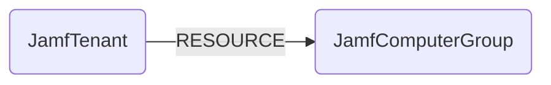

## Jamf Schema



### JamfTenant

Representation of a Jamf Tenant (identified by the Jamf base URI).

> **Ontology Mapping**: This node has the extra label `Tenant` to enable cross-platform queries for organizational tenants across different systems (e.g., OktaOrganization, AWSAccount).

| Field | Description |
|-------|-------------|
| firstseen | Timestamp of when a sync job first created this node |
| lastupdated | Timestamp of the last time the node was updated |
| id | Jamf Tenant ID (the base URI) |

#### Relationships

- `JamfComputerGroup` belongs to a `JamfTenant`.
    ```
    (:JamfTenant)-[:RESOURCE]->(:JamfComputerGroup)
    ```


### JamfComputerGroup

Representation of a Jamf computer group.

| Field | Description |
|-------|-------------|
| firstseen | Timestamp of when a sync job first created this node |
| lastupdated | Timestamp of the last time the node was updated |
| id | The group id |
| name | The friendly name of the group |
| is_smart | Whether the group is [smart](https://docs.jamf.com/10.4.0/jamf-pro/administrator-guide/Smart_Computer_Groups.html) |

#### Relationships

- `JamfComputerGroup` belongs to a `JamfTenant`.
    ```
    (:JamfTenant)-[:RESOURCE]->(:JamfComputerGroup)
    ```
